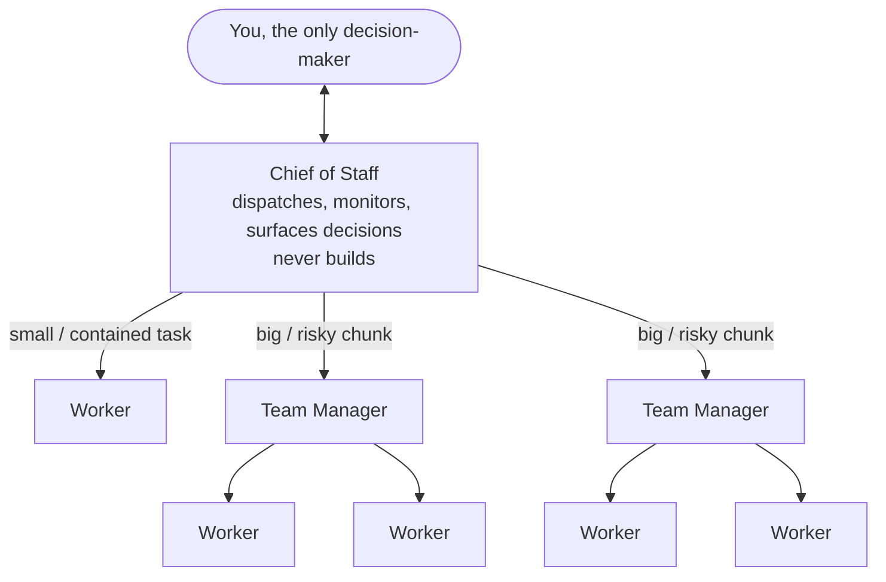
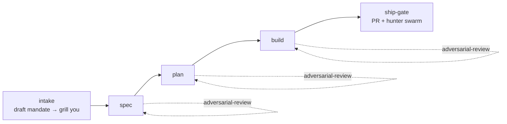

# Scuba Stack

**A multi-agent orchestration org for [Claude Code](https://claude.com/claude-code). Parallelize everything, never block the executive.**

Scuba Stack turns a single Claude Code session into a small organization. You talk to one agent, a **chief of staff**, and it dispatches your work to managers and workers running in parallel. It gates every step through fresh adversarial review, monitors everything in flight, and brings back only the decisions that are actually yours to make. It installs once at the user scope (`~/.claude`) and works in every project.

It ships as plain Markdown: a handful of **skills** (the operating system), a few **agent** definitions (the worker pool), a tiny always-on pointer, and a one-file installer. There's no app to run and no build step. The "code" is prompt discipline.

---

## The idea

Most agent setups serialize: you ask, the agent works, you wait, you ask again. The session you talk to is also the session doing the work, so the moment it starts grinding, you're blocked and so is planning the next thing.

Scuba Stack inverts that. **The executive layer never does the work, so it never blocks.**

- The **chief of staff** (the session you talk to) only ever *dispatches, monitors, and surfaces decisions*. It doesn't triage, review, or build. Those are the signals it's about to get stuck. Its hands stay free, so you can always reach it and keep planning.
- Work fans out to **managers** (who own a chunk end-to-end) and **workers** (who do the production work), as wide as can be kept healthy on a monitoring tick.
- The only deliberate serialization point is **you**. There's one human channel, so decisions come to you one at a time, each with a recommendation. Everything else runs concurrently behind it. Even shipping stays off your critical path: large work is sliced into small stories that merge in parallel, and only the finished epic reaches you.

Quality isn't a final step bolted on. It's structural. Every spec, plan, and diff passes through **fresh, independent, lensed hunters** that each enumerate the *whole* class of a problem, not a few instances, so a fix lands at the root in one pass instead of dragging through round after round. They loop until the verdict is CLEAN. When an external automated reviewer (like a PR bot) is in the loop, Scuba Stack front-runs it instead of waiting on it.

---

## Quickstart

Requires **Claude Code v2.1.32+** and the experimental Agent Teams feature.

```bash
# 1. Install (idempotent, re-run anytime to update)
bash install.sh

# 2. One-time: enable Agent Teams, then restart your terminal
#    Add this to the "env" block of ~/.claude/settings.json:
#    { "env": { "CLAUDE_CODE_EXPERIMENTAL_AGENT_TEAMS": "1" } }
```

Then open Claude Code **on Opus** in any repo, tell it it's your chief of staff, and give it your ask. Full setup is in [INSTALL.md](INSTALL.md). Driving it day to day is in [RUNBOOK.md](RUNBOOK.md).

> **Your files are safe.** The installer is surgical: it only touches Scuba Stack's own files under `~/.claude`. It never overwrites your other skills, agents, or personal `CLAUDE.md`. It appends a single import line once, and backs up your `CLAUDE.md` before that one edit. See [INSTALL.md](INSTALL.md#what-goes-where).

---

## How it works

### The hierarchy



This is the **scaling shape**. Depth stops at three levels: **you → chief of staff → manager → workers**. No manager of managers, and no worker spawns a team. Breadth is capped by what the lead can health-check on each monitoring tick, not by ambition. At current scale the chief of staff wears the manager hat itself for an epic; the spawned teammate manager in the diagram is the scaling path for when one session can no longer hold every epic at once.

- **Chief of staff**: the single session you talk to. Picks the dispatch depth (a direct worker for a contained task, an autonomous manager for a big chunk), keeps a re-arming health poll on everything running, and brings you decisions one at a time. Stays free.
- **Team manager**: owns one chunk end-to-end. Grooms the epic into slices, drives them to merge in parallel (one writer per branch) onto an integration branch, runs the review loop, and monitors its own workers. At current scale the chief of staff runs the manager role itself (a hat it wears, per `team-manager`); a spawned teammate manager is the scaling path.
- **Workers**: the ephemeral agents that do the actual work and then terminate.

### The lifecycle



Every substantive chunk moves **intake → spec → plan → build → ship**, with `adversarial-review` gating each spec/plan/code gate until CLEAN, and `process-health-monitor` running the whole time anything is in flight. You give go/no-go at spec and plan. Agents merge cleared stories onto their integration branch, but you alone merge to main.

**Big work ships in small slices.** Batching an epic into one long-lived PR never converges, because every fix-push draws another review round. So a manager has a `groomer` cut the epic into small, independently-shippable slices (per `sequence-verifiable-units`). Each slice runs the lifecycle above on its own branch and clears onto the epic's **integration branch**, many in parallel, one writer per branch. Agents merge cleared slices there, and the assembled integration branch is the single PR that reaches you.

---

## What's in the box

### Skills (`skills/`)

A skill is a folder with a `SKILL.md`. Its `description` is always in context (it's the trigger). The body loads only when the skill fires. Two families:

**Orchestration / role skills (the operating system):**

| Skill | What it does |
|---|---|
| [`chief-of-staff`](skills/chief-of-staff/SKILL.md) | Operating manual for the top-level orchestrator you talk to |
| [`team-manager`](skills/team-manager/SKILL.md) | Operating manual for a manager that owns a chunk end-to-end |
| [`intake`](skills/intake/SKILL.md) | Turn a raw ask into a dispatchable mandate before any work starts |
| [`adversarial-review`](skills/adversarial-review/SKILL.md) | Gate work with fresh, independent, lensed hunters until CLEAN |
| [`ship-gate`](skills/ship-gate/SKILL.md) | Open the PR, run a hunter swarm in parallel, reconcile, fix at the root |
| [`process-health-monitor`](skills/process-health-monitor/SKILL.md) | Keep delegated background work alive; detect stalls and deaths |
| [`roadmap`](skills/roadmap/SKILL.md) | The state-of-the-world tree the chief of staff keeps current and recovers from |
| [`arena`](skills/arena/SKILL.md) | Race several independent attempts at a genuinely uncertain design |
| [`html-executive-brief`](skills/html-executive-brief/SKILL.md) | Render the milestone brief the chief of staff presents to you |

**Engineering-principle skills (the "how to think" library the org references):**

`integrate-dont-bolt-on`, `boundary-discipline`, `foundational-thinking`, `experience-first`, `type-system-discipline`, `minimize-reader-load`, `laziness-protocol`, `subtract-before-you-add`, `sequence-verifiable-units`, `exhaust-the-design-space`, `redesign-from-first-principles`, `build-the-lever`, `outcome-oriented-execution`, `make-operations-idempotent`, `migrate-callers-then-delete-legacy-apis`, `separate-before-serializing-shared-state`

### Agents (`agents/`)

Each agent is a single `.md` file defining a subagent type, with its model pinned in frontmatter.

| Agent | Model | Role |
|---|---|---|
| [`architect`](agents/architect.md) | Opus | Designs the spec and plan; never builds |
| [`groomer`](agents/groomer.md) | Opus | Cuts an epic into small, independently-shippable slices; never designs or builds |
| [`hunter`](agents/hunter.md) | Opus | Fresh adversarial finder; runs the touched tests, enumerates the whole class, returns CLEAN-or-findings, never fixes |
| [`intake-drafter`](agents/intake-drafter.md) | Opus | Drafts the mandate the chief of staff grills you against |
| [`senior-implementer`](agents/senior-implementer.md) | Opus | Builds planned implementation against an approved plan |
| [`bug-fixer`](agents/bug-fixer.md) | Opus | Solves bugs and reconciles review/PR findings holistically: reproduce, root-cause, repair the system (not just the test) |
| [`researcher`](agents/researcher.md) | Opus | De-risks one specific unknown |
| [`brief-specialist`](agents/brief-specialist.md) | Opus | Renders the milestone executive brief from the control plane |
| [`scribe`](agents/scribe.md) | Opus | Keeps the roadmap current so the chief of staff never blocks; runs the recovery mirror |

### Every worker runs on Opus (load-bearing)

Every worker agent runs on **Opus**: `architect`, `groomer`, `hunter`, `intake-drafter`, `senior-implementer` (executing a plan), `bug-fixer` (independent root-cause work), `researcher` (gathering), `brief-specialist` (rendering), and `scribe` (roadmap bookkeeping). Judgment and code-writing demand it, and the support roles run on Opus too rather than risk a weaker read anywhere in the org. Worker models are pinned in their files. The chief of staff and managers are **not** pinned; they inherit the session model. So **always start the lead session on Opus**, or the whole org silently downgrades with it.

---

## State lives in the control plane, not the chat

Scuba Stack never relies on transcript memory, and since workers build in isolated worktrees, state can't live with the code either. It lives in **one shared `.scuba/` control plane in your primary working tree**, which every agent writes to by absolute path (code goes in the worktrees, orchestration docs go here). So it's always visible on whatever branch you're on, and a fresh chief of staff recovers the whole world from it.

```
your-repo/
  .scuba/                # the control plane: gitignored, visible on your branch, not in any worktree
    roadmap.md           # resume anchor: a Mermaid tree of every thread; nodes link to spec/plan/brief
    teams/<team>/        # per-manager state: status, spec, plan, decisions
    briefs/              # rendered milestone briefs
```

`roadmap.md` is the source of truth: a Mermaid tree of every in-flight thread and its stage, a "now active" digest, and the decisions waiting on you. Each node links to its artifacts (spec → plan → executive brief). The per-thread recovery detail (branch, worktree, last SHA, next step) lives in its `status.md`. The chief of staff reads it first and keeps it current on its monitor tick, delegating to a `scribe` rather than blocking. For recovery beyond the local disk, the control plane is mirrored to a per-user branch `scuba-state/<you>` (namespaced by your git email, so distinct users don't clobber each other's state) and pushed every heartbeat. So after a crash, an API outage, or an archived conversation, you fetch, restore `.scuba/`, and pick every agent back up where it left off.

---

## Per-project setup

Nothing is required per repo. Optionally, copy [`project-template/CLAUDE.md`](project-template/CLAUDE.md) into a project to record its stack, paths, commands, and how its external PR reviewer is triggered. The global org rules live at `~/.claude` and must **not** be repeated into project files. That's the whole point of the user-scope install.

---

## Repository layout

```
scuba-stack/
  global-CLAUDE.md          # the tiny always-on pointer (installed as ~/.claude/scuba.md)
  install.sh                # manifest-driven, surgical, idempotent installer
  skills/<name>/SKILL.md    # the skills (loaded on demand)
  agents/<name>.md          # the worker pool (models pinned in frontmatter)
  project-template/CLAUDE.md# per-project context template
  INSTALL.md                # full install guide
  RUNBOOK.md                # daily operation
  CLAUDE.md                 # guidance for working in *this* repo
  ARCHITECTURE.md           # the design, in depth
```

To add a capability, drop in a `skills/<name>/SKILL.md` folder or an `agents/<name>.md` file and re-run `install.sh`. The installer auto-discovers it. No registration step.

---

## Status

Experimental. It rides Claude Code's **experimental** Agent Teams feature and is built entirely from prompt discipline, so behavior varies with the model and the feature's evolution. A multi-team run costs several times a single session, and the control-plane-first coordination rule is what keeps that in check. Read [RUNBOOK.md](RUNBOOK.md#cost-and-behavior-notes) before running a wide fan-out.

---

## Lineage & credits

Scuba Stack stands on two projects and contributes its own orchestration model:

- **[superpowers](https://github.com/obra/superpowers)** by Jesse Vincent (MIT), which pioneered disciplined, aggressively-triggered skills for Claude Code and the convention of skills as on-demand, description-routed Markdown.
- **[pstack](https://github.com/cursor/plugins/tree/main/pstack)** by Lauren Tan (poteto), MIT, the deepest influence. Scuba Stack draws on pstack's engineering-principle vocabulary (`laziness-protocol`, `foundational-thinking`, `boundary-discipline`, and ~14 more), its parallelize-with-confidence and *never-block-on-the-human* ideas (which Scuba Stack reframes as "never block the executive"), and its evidence-driven, root-cause bug-fixing doctrine, which is the foundation the `bug-fixer` agent is built on.
- **Scuba Stack's own contribution:** the **orchestration model**: a standing chief-of-staff → manager → worker org with `intake`, `adversarial-review`, `ship-gate`, `process-health-monitor`, the `roadmap`, slice-and-integration-branch shipping (`sequence-verifiable-units`), and a durable shared control plane, in which the executive layer only ever *dispatches* and therefore never blocks. (pstack reaches quality through `poteto-mode` and playbooks; Scuba Stack reaches it through a persistent org.)

Scuba Stack is **independently written**. It reuses none of those projects' prose. (Verified by deterministic 8-gram scan against the superpowers corpus, the `cursor/plugins` repo including pstack, and every other locally installed skill: the only shared word-sequences are the engineering-principle skill *names* themselves, shared vocabulary rather than copied text, which the credit above acknowledges.) The credit is for inspiration and vocabulary, not for copied material.

The skill/agent file format is Claude Code's own [Agent Skills](https://docs.claude.com/en/docs/claude-code/skills) format, used across the ecosystem.

---

## License

[MIT](LICENSE) © 2026 Palanca Development. See [CONTRIBUTING.md](CONTRIBUTING.md) to contribute.
