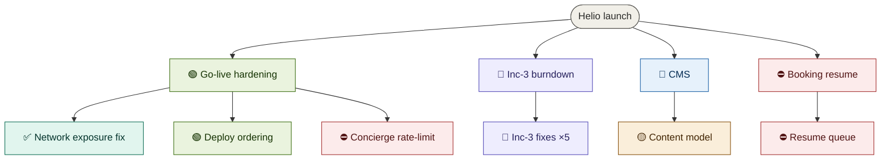

# Helio launch — roadmap
**Updated** 2026-06-13 14:20 · `chief-of-staff` · mirror `scuba-state/dan-acme-com@e1f2a3b`

## Now active
- 🟢 **Deploy ordering** — deploy-order fix verifying on staging; `ship-gate` next. → [status](teams/golive/deploy.status.md)
- 🔎 **Inc-3 fixes** — PR [#31](https://github.com/acme/helio/pull/31) up, internal swarm CLEAN, awaiting external reviewer.
- 🟡 **CMS content model** — architect drafting the spec. → [spec (draft)](teams/cms/spec.md)
- ⛔ **Concierge rate-limit** — blocked on the network-exposure fix merging.

## Decisions waiting on me
1. **Booking resume queue** — Redis vs SQS? → [context](teams/booking/decisions.md)
2. **CMS author permissions** — reuse platform RBAC, or a separate model? → [context](teams/cms/decisions.md)

## Roadmap

_Node labels carry the stage emoji (🟡 spec · 🔵 plan · 🟢 execution · 🔎 review · ⛔ blocked · ✅ done · 💤 parked); colour comes from the matching `classDef` — don't invent new ones. Click a node to open its artifact; artifacts chain **spec → plan → executive brief**. Per-thread recovery detail (branch · worktree · last SHA · next · blocker) lives in each thread's `status.md`._
