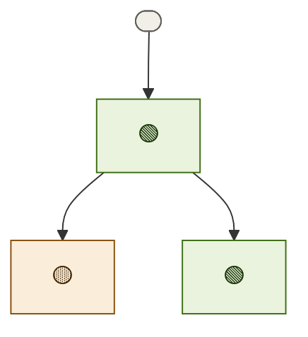

# <Project> — roadmap
**Updated** <YYYY-MM-DD HH:MM> · <chief-of-staff | scribe> · mirror <scuba-state/<slug>@<sha>>

## Now active
_One or two lines per currently-moving thread — what's happening right now._
- <emoji> **<thread>** — <one-line status> → [status](teams/<team>/<thread>.status.md)

## Decisions waiting on me
_(Empty when none; never bury a decision.)_
1. **<thread>** — <the call, one line> → [context](teams/<team>/decisions.md)

## Roadmap

_Node labels carry the stage emoji (🟡 spec · 🔵 plan · 🟢 execution · 🔎 review · ⛔ blocked · ✅ done · 💤 parked); colour comes from the matching `classDef` — don't invent new ones. Click a node to open its artifact; artifacts chain **spec → plan → executive brief**. Per-thread recovery detail (branch · worktree · last SHA · next · blocker) lives in each thread's `status.md`._
